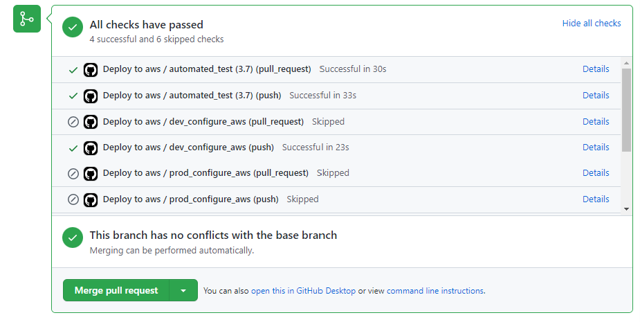

# Introduction
The output of data science, data analysts and data engineers work is a data product which delivers rather a result for a specific business critical question than pure data (Loukides, 2011, p.4). Developing data products remains a challenging task, e.g. up to 80-85% of the data science projects are never implemented into production (Thomas, 2020). The main reasons are: “waste, misalignment with the business, and difficulty in productionizing data science outputs at scale” (Atwal, 2020, p. xxvii). Similar challenges were successfully addressed in software development with DevOps methodologies. The development of data products is a complex process involving both data and code. The data dimension adds more complexity in comparison to building software products with DevOps. These additional complexities can be addressed by DataOps methodologies. DataOps includes agile methodologies (e.g. reducing the cycle time of releases), DevOps practices (e.g. CI/CD pipelines) and lean manufacturing (e.g. right first time). In comparison to DevOps is DataOps still in its infancy and needs to proof its practicability and added value for the development of data products. In this master thesis DataOps methodologies are used to demonstrate the feasibility and benefits for developing a data product for analyzing tweets.

# Getting started

## Required Accesses 
To deploy the aws_tweets_analyzer a AWS user  as well as access rights to the Twitter API are required. 

### AWS Access
* Create an AWS account [Link](https://aws.amazon.com/de/premiumsupport/knowledge-center/create-and-activate-aws-account/)
* Retrieve the AWS Access tokesns: Access key and Access Secret Key 
* Create an IAM user with sufficient rights (e.g. AdministratorAccess) [LINK](https://docs.aws.amazon.com/IAM/latest/UserGuide/id_users_create.html)
  
  
### Twitter API v2
* Apply for the access to the Twitter API (Essential Access) [Link](https://developer.twitter.com/en/docs/twitter-api/getting-started/getting-access-to-the-twitter-api)
* For the Elevated access an additional application is required within the developer portal
* Get the BEARER Token [Link](https://developer.twitter.com/en/docs/authentication/oauth-2-0/bearer-tokens)

## GitHub Preparation 

### Set Parameters 
The Parameter can be set in the GitHub Repository (Settings --> Secrets --> Actions --> New repository secrets) 

The following Parameter are needed: 
* AWS_ACCESS_KEY_ID (AWS Access Key)
* AWS_SECRET_ACCESS_KEY (AWS Access Secret Key)
* BEARERTOKEN (Twitter Bearer Token)
* DEV_TWEETS_DATA (The path to the S3 bucket to store the Tweets data for the development environment in, e.g. s3://dev-tweets-data/)
* DEV_TWEETS_SOURCE_META (The path to the S3 bucket to store the meta data for the development environment in, e.g. s3://dev-tweets-source-meta/)
* PROD_TWEETS_DATA (The path to the S3 bucket to store the meta data for the production environment in, e.g. s3://prod-tweets-data/)
* PROD_TWEETS_META_SOURCE (The path to the S3 bucket to store the meta data for the production environment in, e.g. s3://prod-tweets-source-meta/)
* TWEET_STARTDATE_DEFAULT (Default date from when the Tweets of the timeline are retrieved: #Example '2022-07-10T08:00:00Z)

## Adjust the list of tracked Twitter Profiles 
 The list of Twitter user to be tracked are specified in the user_ids.txt file in the folder user_ids. 

 Example:
 ~~~
1233052817390284800,851431642950402048,40129171,332617373,1701930446,37065910,998503348369272832,2541212474,2767778093,281766494,2215783724,1080799090538172416,714051110
 ~~~ 
 The values are comma separated. Please be aware that spaces are not allowed. 

# First Run 

## Fork & Clone Repository

Fork the repository to copy the repository into your account: 
If you dont know how to do it use this manual: [Link](https://docs.github.com/en/get-started/quickstart/fork-a-repo) 

After the repository is forked please clone the Repository to get started. (Atention: Plase enter YOUR-USERNAME)
~~~
git clone git@github.com:YOUR-USERNAME/aws_tweets_analyzer.git
~~~

## Start Production Environment

A GitHub Actions Workflow deploy fully automated the value pipeline/ the production environment either when a no commit is pushed on the prod branch to the GitHub repository or when a pull request is sent to merge the dev branch to the prod branch. 
To start initially the production environment a simple push is sufficient: 

~~~
#Your on the branch 'prod'
git add -A
git commit -m"YourText"
git push
~~~

## Innitial GitHub Actions Workflow 
The initial workflow for deploying the production environment looks like: 

The Workflow can be seen under the tab Actions in your GitHub Repository. 

The DataOps architecture is descrivbed in detail in the following:  

# Clean Up

To stop all AWS Services the stack (either 'prod' or 'dev' or both) needs to be deleted. Visit the AWS Webpage and go to the service CloudFormation to see all running stacks. 
Chosse the running stack you want to delete and press the delete button. 
The databases are not generated via the CloudFormation template. Thus, these databases needs to be removed manually. Go to the Glue service. Under the tab Data Catalog --> Databases are allo Glue databases listed. Delete the corresponding database. With the deletion of the database all coresponding tables are deleted as well. 

# DataOps Architecture

Bergh proposed in the book “The DataOps Cookbook – Methodologies and tools that reduces analytics cycle time while improving quality” an DataOps data architecture. The core idea of this architecture is focus on how to deploy code in data analytics and data science projects to production with low cycle time, high data quality and low downtime risks. From a high level perspective Bergh proposed “decouples operations from new analytics creation and rejoins them under the automated framework of continuous delivery” (Bergh et al., 2019). This decoupling happens through the separation of work in two pipelines: Value pipeline and innovation pipeline (see figure below).

The value pipeline describes the current production pipeline. Raw data is ingested in the system, data is cleaned, features are extracted and feed to the production system where either a ML/AI model is deployed or advanced analytics operation are performed. Finally the results can be visualized and value is achieved for the end-customer. The Innovation pipeline is a pipeline is focusing on the deployment of new production models. The process steps within one of the tow pipelines can be executed either in a serial or parallel manner. The two pipelines are completely controlled by code (infrastructure-as-Code). Behind the two pipelines is a sophisticated DataOps data architecture. Different environments are used. For example the development is done in the development environment. The development environment can be a copy of the production environment. The separation of the environments is beneficial since the development is not impacting the production and it simplifies the deployment into production. The value pipeline runs in the production environment. The innovation pipeline automate the processes from the idea, to the  development of new features in the “dev” environment and the successfully deployment and testing of the new feature in the “prod” environment. All processes are highly automated. The workflows in the value pipeline are automated e.g. with an workflow orchestration tool or ETL pipelines. The deployment of the successful created new feature in the “prod” environment (CI/CD) is automated including automated tests before deployment. All infrastructure is described in code (infrastructure as code) which enables an automated provisioning of the infrastructure for “prod” as well as for the “dev” environment. Code is saved in a version control system like git. Meta data is saved to gain additional insights and to detect errors early as possible. Secrets are used to simplify the authentication. Specific secret storage possibilities exists to ensure the safe operations. Parameters are used to simplify for example the automated infrastructure provisioning. Data pipelines are key components in DataOps architecture. The next chapter is focusing on the data pipelines

## The Value Pipeline

Twitters API v2 is used to retrieve the Tweets from the users timeline via a URL request. The URL request is sent by a scheduled Lambda function. The Lambda function fetches the Tweets for each Twitter user tracked, updates the JSON format and upload the file into a S3 bucket. Lambda is an serverless AWS resource and is provided as Function-as-a-Service. The ingested raw Tweets have a highly nested JSON schema. Valuable information needs to be extracted from the raw data. First the nested JSON structure is flattened which allows to extract useful entity information like Hashtags, URLS, Mentions or Annotations. And second a sentiment analysis is conducted to enrich the data.  The data processing is done in an Glue ETL Workflow. The workflow combines several steps to process the data. The raw Tweets data is cataloged (reading data into a Glue data catalog table) by a Glue Crawler. The data processing part is conducted by a Glue Job. A Glue Job basically executes a PySpark script on a cluster. In this step the highly nested raw data is flattened (rationalized) and a sentiment analysis is conducted with a user defined function calling the AWS Comprehend service. AWS Comprehend is a NLP tool to conduct sentiment analysis. The processed data (entities like hashtags, mentions, annotations, URLs or the sentiment) is saved in JSON format in a S3 bucket. A Glue Crawler is cataloging the processed data into a Glue data catalog. AWS Athena can query the given data based on the meta database Glue data catalog. The processed Tweets are visualized with AWS QuickSight which is an BI Tool. AWS QuickSight has an build in interface with Athena databases to simplify the data transmission. Each of this components is described in detail below.

## The Innovation Pipeleline

The innovation pipeline facilitate to develop and productionize new features rapidly with an high degree of automation in high quality. With CI/CD changes can be brought in a production ready state in short time without manual work. Automated testing assures quality of the developed code. Infrastructure needed for the deployment is provided automated. This chapter explains the operating principle of the innovation pipeline. 

### Phase One: The Idea
In the Idea phase a new idea for a feature is found. Is it beneficial to collect ideas and to evaluate the benefits, risks and efforts to develop for each idea. Based on the evaluation a ranking of the ideas can help to develop the ideas with the highest potential. Another starting point is to explore possibilities of new feature without having the exact solution in mind (experimentation). Often errors or bugs in the production system are the starting point of the innovation pipeline as well. Errors can be analysed in great detail in an development environment to understand the dependencies and to avoid quick fixes causing new errors. Many deployed Machine Learning models decay over time. Updating the model can be another starting point of the Innovations Pipeline. 

### Phase Two: The Development
The development phase has two steps: In the first step the development environment is provisioned and in the second step development work itself is done. The development environment is provided as follows: 
A branch called ‘dev’ is created as a copy of the ‘prod’ branch. The commands for the creation of a new branch ‘dev’ are depicted as follows: 

~~~
List all branches (only the ‘prod’ branch should exists)
git branch -a
#Create the new branch ‘dev’
git checkout -b dev
~~~

The first push to the remote repository on the ‘dev’ branch is triggering an GitHub Actions workflow providing the development environment. The workflow is depicted as follows:

 
Source: Own representation
The workflow contains three jobs with multiple steps each. In the first job automated test scripts are executed to reduce errors. If the automated tests succeeded the ‘dev’ environment on AWS is prepared and configured in the second job. After the preparation and configuration, the needed infrastructure is provisioned by AWS CloudFormation. The complete infrastructure is defined by code (infrastructure as code). The execution of the three jobs follow an order shown in Figure 30. Dependent on the current branch (‘dev’ or ‘prod’) the jobs dev_configure_aws and dev_deploy_cloudformation for ‘dev’ or prod_configure_aws and prod_deploy_cloudformation for ‘prod’ are executed. The current branch is retrieved by  a context variable. The three jobs are explained in detail in the following: 
Automated tests are conducted to assure the high quality code and to increase the robustness during the execution of the job ‘automated_test’. Three types of tests are conducted: unit test, parameter checks and a check of the CloudFormation template. The Python library unittest is used to conduct unit tests. The basic concept for unit test in Python during the GitHub Actions workflow is shown as follows: 
~~~
      - name: Update Python and install requests
        run: |
          cd $GITHUB_WORKSPACE
          python -m pip install --upgrade pip
          pip install requests
        
      - name: Run Unit Tests
        run: | 
          python -m unittest test_unittest.py
          echo "unittest is finished"
~~~

First PIP is updated and the needed libraries are installed (in this case requests). A test script is written to specify the tests which is executed by the command ‘python -m unittest test_unittest.py’. An example is shown as follows: 
~~~
#Import Libraries
import unittest
from lambda_tweets_loader.getTimelineUtil import create_url

#Definition of Test Class
class TestLambda(unittest.TestCase):
    def test_create_url(self):
      
        self.assertEqual(create_url("NielsID","202202011000",max_results=100),'https://api.twitter.com/2/users/NielsID/tweets?max_results=100&start_time=202202011000')
        self.assertEqual(create_url("NielsID","202202011000",pagination_token="DiesIstEinPaginationToken",max_results=100,'https://api.twitter.com/2/users/NielsID/tweets?max_results=100&start_time=202202011000&pagination_token=DiesIstEinPaginationToken')
~~~

Each test case is defined in a function - here def test_create_url(). The function are gathered in a test class – here TestLambda(). The depicted test function tests the create_url() function in the script getTimelineUtil.py.

The workflow is highly parameterized. The existence of the parameter is tested. The following code snipet shows an example to check whether the parameter for the BEARERTOKEN exists. 
~~~
      - name: Negative Check Parameter BEARERTOKEN exists
        env:
          MY_Secret: ${{ secrets.BEARERTOKEN }}
        if: "${{ env.MY_Secret == '' }}"
        uses: actions/github-script@v3
        with:
          script: |
            core.setFailed('Secret BEARERTOKEN is empty')
~~~
The CloudFormation template is tested with the GitHub Action scottbrenner/cfn-lint-action@v2 (see below).
~~~
      - name: Setup Cloud Formation Linter
        uses: scottbrenner/cfn-lint-action@v2
      
      - name: Run the CloudFormation Template Tester (Linter)
        run: |
          cfn-lint --version
          cfn-lint -t aws_infrastructure_provisioning/Lambda_GlueWorkflow_deploy.yml
~~~
After the automated tests are succeeded, AWS is prepared and configured during the execution of the second job (dev_configure_aws). This job only starts when the automated_test job succeeded with the command ‘need: automated_test’. The name of the current branch is checked as well with the help of a context variable (if: ${{ github.ref == 'refs/heads/dev' }}). The job ‘dev_configure_aws’ is executed only if the two conditions are met. If one of this conditions are not true the execution stops. The Job is running on a ubuntu runner (see below).

~~~
    if: ${{ github.ref == 'refs/heads/dev' }} 
    needs: automated_test
    runs-on: ubuntu-latest
~~~

In the Job dev_configure_aws actions are used to simplify the code with reusable code components. GitHub Actions actions/checkout@v2 is used to copy the data from the GitHub repository to the runner (GitHub, 2022f). The GitHub Actions aws-actions/configure-aws-credentials@v1 configure the AWS Credentials on the runner instance to enable AWS CLI commands (AWS, 2022i). The configuration of the AWS credentials on the runner system is depicted below. The access Tokens are saved as a secret in GitHub.

~~~
      - name: Configure AWS Credentials
        uses: aws-actions/configure-aws-credentials@v1
        with:
          aws-access-key-id: ${{ secrets.AWS_ACCESS_KEY_ID }}
          aws-secret-access-key: ${{ 
secrets.AWS_SECRET_ACCESS_KEY }}
          aws-region: eu-central-1
~~~

After the AWS credentials are configured, AWS CLI commands can be committed. In the Step “Copy data into dev environment” the PySpark script as well as the ZIP file for the Lambda function are uploaded to the dedicated S3 Bucket. The address of the dedicated S3 Bucket is saved in a GitHub secret (secrets.DEV_TWEETS_SOURCE_META). 

~~~
      - name: Copy data into dev environment
        run: |
          aws s3 sync ./glue_pyspark_job  s3://${{secrets.DEV_TWEETS_SOURCE_META }}/pyspark_script/
          cd lambda_tweets_loader
          zip -r ../TweetLoaderZIP.zip .
          cd ../ 
          aws s3 cp TweetLoaderZIP.zip 3://${{secrets.DEV_TWEETS_SOURCE_META }}/lambda-source/
~~~

The AWS resources require parameter to perform their tasks. The required parameter are user_ids (list of Twitter user ids to be tracked), DEV_TWEETS_DATA (S3 Bucket to store the retrieved data in), DEV_TWEETS_SOURCE_META (S3 Bucket for meta data and scripts), TWEET_STARTDATE_DEFAULT (default start date for retrieving the Tweets from the user timeline). The parameters are originally stored as GitHub Secrets (single source of truth). AWS CLI commands save the GitHub Secrets as a AWS Parameter in the AWS Parameter Store (SSM). The following code snippet shows the AWS CLI commands to store the parameter DEV_TWEETS_DATA in AWS SSM.  
~~~
- name: Set parameters for dev environment
        run: |
          aws ssm put-parameter --name DEV_TWEETS_DATA 
--value ${{ secrets.DEV_TWEETS_DATA }}  --type "String" –overwrite
   *** further Shell commands ****
~~~

The job dev_deploy_cloudformation_template is executed after the successful preparation and configuration of the development environment on AWS. This job uses the GitHub Action aws-actions/aws-cloudformation-github-deploy@v1 to trigger AWS CloudFormation to provision the AWS infrastructure for the development environment. The GitHub actions checkout and configure-aws-credentials  are used to copy the data to the runner and to provide the credential to access AWS. The main part of the code is depicted below. The name of the CloudFormation stack is dev-tweet-analyzer-stack. The path to the CloudFormation template is given (aws_infrastructure_provisioning/ Lambda_GlueWorkflow_deploy.yml). As explained in chapter 4.2.7 AWS CloudFormation Templates uses parameters. Values of Parameters can be passed during the execution of CloudFormation. The GitHub Actions passes the parameter via the parameter-overrides statement (e.g. the CloudFormation parameter DataBucket is defined with the GitHub Secret (secret.DEV_TWEETS_DATA). GitHub remains the single source of truth.
~~~
      - name: Deploy to AWS CloudFormation
        uses: aws-actions/aws-cloudformation-github-deploy@v1
        with:
          name: dev-tweet-analyzer-stack
          template: aws_infrastructure_provisioning/Lambda_GlueWorkflow_deploy.yml
          parameter-overrides: "Environmentval=dev,DataBucket=${{ secrets.DEV_TWEETS_DATA }}, **additional parameter**
~~~

The development environment in AWS is provisioned and the development can start.
After an incremental change is ready to be tested in the development environment, the change is committed and pushed to the remote repository. Each push of code into the GitHub repository on the ‘dev’ branch triggers the described GitHub Actions workflow again. The code is tested  automated, AWS is prepared and configure and CloudFormation identifies whether changes of the resources are made by creating a change set and if yes the stack is updated accordingly. Only the resources which are included in the change set are updated via CloudFormation. The incremental change is now fully deployed to the ‘dev’ environment and can be evaluated by the developer. It is best practice to write new test cases for every code component written.  
Phase Three: Productionizing
After the development is completed the changes can be productionized in the third phase of the innovation pipeline. The GitHub Actions Workflow for productionizing is similar to the workflow for the development. The workflow is highly parameterized. Based on the environment variable (‘dev’ or ‘prod’) the development or production environment on AWS is prepared and configured as well as the creation of the dev or prod CloudFormation stack. The GitHub workflow is described in this chapter above. The following steps are conducted to productionize the changes. A pull request to merge the ‘dev’ branch into the ‘prod’ branch is created.  Before the merge is executed the automated test scripts are executed. The merge can be triggered manually if the test scripts passes (see figure below). It’s possible to merge code without passing the test cases which is not best practice.

 

If the merge is triggered the GitHub Actions deployment workflow for the production branch is executed (Merge pull requests  Confirm Merge). As a safety measure the execution of the jobs prod_confiure_aws and prod_deploy_cloudformation needs to be confirmed manually (see Figure below).

An alternative is to merge the ‘dev’ branch into the ‘prod’ branch via git CLI commands and push a new commit to the GitHub repository on the ‘prod’ branch to deploy/ update the production environment. The commands for the CLI merge are shown below.
~~~
# List all branches (current branch ‘dev’ and ‘prod’ branch) 
git branch -a
#Switch to ‘prod’ branch
git checkout prod
#Merge dev into prod
git merge dev
#Delete dev branch to clean up 
git branch -d dev 
~~~

# Error Handling

## Timeout of Lambda function
The Lambda function is timed out when the fetching of Tweets from the Twitter API takes longer than 300 seconds. If a time out occur there are three possible solution: 
* Increase the Timeout to up to 900 seconds
* If the error occur on the initial deployment choose a TWEET_STARTDATE_DEFAULT which is more recently to reduce the load time
* Reduce the number of number of users to track 
900 seconds is sufficient to load a big volume of Tweets

## The Glue Tables are messes up 

The normal Glue table schould look like: 

If there are tables for single files an error occured. This error can occur when e.g., the data schema schanged from one load to the next load. 
Best solution is to delete the folder with the Tweets Data, the Meta data folder with the bookamrks as well as the whole Glue Database and start from scratch. 

